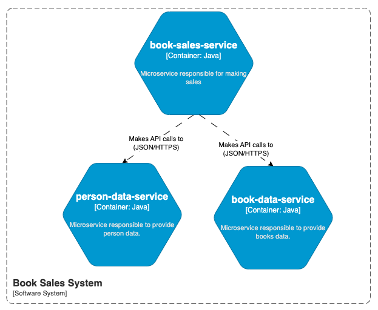
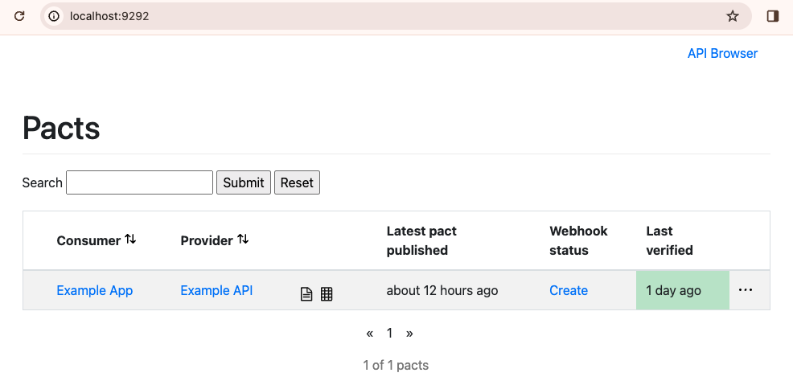
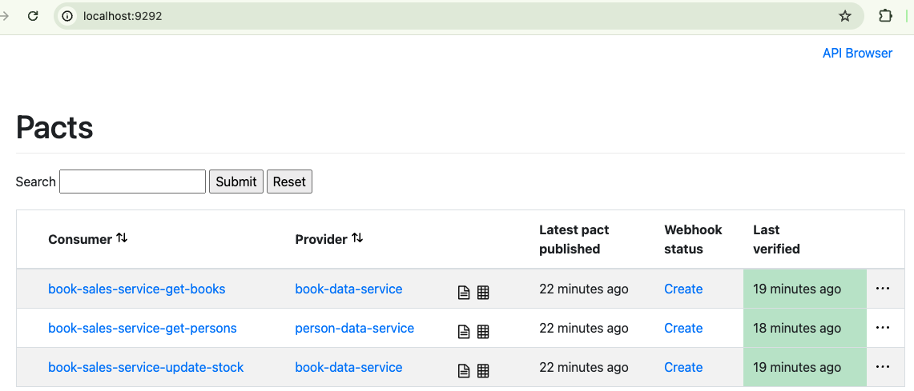

# Pact Contract Test
This repository presents a use case of contract testing employing [Pact](https://docs.pact.io/) tests. To facilitate contract testing, three microservices were developed to assess integration: `book-sales-service`, `person-data-service`, and `book-data-service`.

- The `person-data-service` has an API that receives the person's code and returns their data.
- The `book-data-service`has two APIs: one that receives the book code and returns its data, and another responsible for updating the stock.
- The main service is `book-sales-service`. This service is responsible for carrying out the sales operation, orchestrating integration with other microservices.

<p align="center">
  
</p>

## Table of contents
* [Technologies](#technologies)
* [Getting started](#getting-started)
  * [Starting Pact broker](#starting-pact-broker)
  * [Starting book-sales-service](#starting-book-sales-service)
  * [Starting book-data-service](#starting-book-data-service)
  * [Starting person-data-service](#starting-person-data-service)
  * [Contract Tests](#contract-tests)
* [Testing the APIs](#testing-the-apis)
  * [Testing person-data-service](#testing-person-data-service) 
  * [Testing book-data-service](#testing-book-data-service)
  * [Testing book-sales-service](#testing-book-sales-service)
* [Starting with docker compose](#starting-with-docker-compose)


## Technologies
* Java
* Spring Boot
* Pact test

## Getting started
All microservices are located in the `microservices` folder. Each of them was created using Java, Spring Boot, and Gradle. Considering the purpose of this project, which is contract testing, there is no integration with a database; all the data are stored in an in-memory collection.

### Starting Pact broker
It's necessary to start a `pact` broker container to receive the contracts and enable verification. There is a `docker-compose` for all services; the command below shows how to start only the `pact` broker.
```
docker-compose up pactbroker -d
```

The `pact` broker will be available at `http://localhost:9292/`. A similar page as shown below will be accessible.

<p align="center">
  
</p>

### Starting `book-sales-service`
In the `microservices/book-sales-service` folder, it's necessary to clean and build the project.
```
./gradlew clean build
```
To publish the contracts to the `broker`, it's necessary to run the command below.
```
./gradlew pactPublish
```
The service can be started with the command below.
```
./gradlew bootRun
```
### Starting `book-data-service`
In the `microservices/book-data-service` folder, it's necessary to clean and build the project. In this case, contract verifications will be run with tests.
```
./gradlew clean build
```
The service can be started with the command below.
```
./gradlew bootRun
```

### Starting `person-data-service`
In the `microservices/person-data-service` folder, it's necessary to clean and build the project. Similarly, contract verifications will be run with tests.
```
./gradlew clean build
```
The service can be started with the command below.
```
./gradlew bootRun
```
### Contract Tests
After running all consumer and provider tests, the broker will have the current status of all contracts. The image below displays the current status of the broker.

<p align="center">
  
</p>

## Testing the APIs

### Testing `person-data-service`
Retrieve details for a specific person.
```
curl --location --request GET 'http://localhost:8082/persons/1001'  
```
Retrieve details for all persons.
```
curl --location --request GET 'http://localhost:8082/persons'  
```

### Testing `book-data-service`
Retrieve details for a specific book.
```
curl --location --request GET 'http://localhost:8081/books/201'
```
Retrieve details for all books.
```
curl --location --request GET 'http://localhost:8081/books'
```
Update the stock of a book.
```
curl --location 'http://localhost:8081/books/updateStock' \
--header 'Content-Type: application/json' \
--data '{"id": 202,"quantity": 1}'
```

### Testing `book-sales-service`
Processing a book sales transaction.
```
curl -X POST --location 'http://localhost:8080/book-sales' \
--header 'Content-Type: application/json' \
--data '{"personId": 1001,"bookId": 203}'
```
## Starting with docker compose
There is an option to start all services using `docker-compose`. This approach is preferable for observing the integration between all services within a `black-box` context.

First make sure that all services is not running and all ports are available to use. When applicable, down all services that is running with the command below.
```
docker-compose down
```
When necessary remove the images, run the command below.
```
docker rmi book-sales-service:v1
docker rmi person-data-service:v1
docker rmi book-data-service:v1 
```
Now the containers can be started with the command below.
```
docker-compose up book-data-service person-data-service book-sales-service -d
```
More details to run tests are available in the [Testing the APIs](#testing-the-apis)

## TODO
### Article
- OK - Finish the topic - Verificação do contrato pelos providers
- OK - Finish the topic - Simulação 3: Provider altera nome do campo para requisição de POST
- OK - Change all branches name - simulation-1-blababla
- OK - Review all images;
- OK - Review all code;
- OK - Refine the text;
- OK - Second refinement;
- OK - Verify all files and create a new project with only one commit - Not forget branches
- OK - Add to readme the steps to start the application without docker 
- OK - Add to readme the steps necessary to run the providers/consumers test
- OK - Add to readme how it's possible to test all API
- OK - Add to readme the steps necessary to run the services with docker-compose
- Cover all code with unit tests;
- Final test without Docker;
- Final test with Docker;
- Third and last refinement;
- Add github project as a public in subproject
- Publish my Github;
- Translate to English;
- Publish to Medium (English)
- Publish to TW (English and Portuguese)
